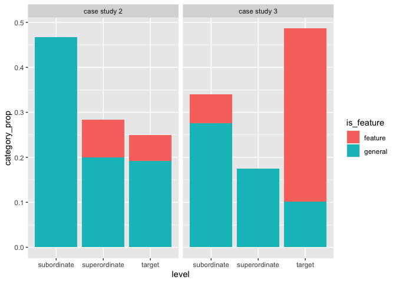

Verifying QA task decomposition
================
PT
2024-12-31

# Explaining answers

The live experiment can be found
[here](https://polina-tsvilodub.github.io/goal-inferences/experiments/qa_explanations/).
Below we look at descriptive stats over different types of explanations
participants generate, when exposed to competitor responses from case
studies 2 and 3. The situations and responses are presented in third
person. These results are from pilots in contexts where the participants
explain the answers to an alien Bo.

``` r
cs2 <- read_csv("../data/qa_explanations/results_8_cs2_pilot2.csv")
cs3 <- read_csv("../data/qa_explanations/results_9_cs3_pilot1.csv")
```

Below we plot the counts of the different explanations. The explanations
were manually classified into the following categories:

- inference: any explanation that made some kind of reference to the
  questioner. For cs2, this often included explanations saying that the
  response offers something that is similar to what the questioner asked
  for. For cs3, it includes both answers generally mentioning that the
  questioner wants the item, and those explaining functional properties
  of the items.
- literal: explanations that focused on the “no” part, saying that the
  item asked for was not available.
- other: unclassifiable explanations.
- similarity: explanations only mentioning the similarity between the
  target and offered option, but not mentioning the questioner.

``` r
cs2_main <- cs2 %>% filter(correct_response == "main") %>%
  mutate(experiment = "case study 2")
cs3_main <- cs3 %>% filter(correct_response == "main") %>%
 mutate(experiment = "case study 3")

explanations_pilot <- rbind(cs2_main, cs3_main)

explanations_pilot %>%
  group_by(experiment, category) %>%
  summarise(
    category_count = n()
  ) %>%
  ggplot(., aes(x = category, y = category_count, fill = category)) +
  geom_col() +
  facet_wrap(experiment~.)
```

    ## `summarise()` has grouped output by 'experiment'. You can override using the
    ## `.groups` argument.

<!-- -->

# Inferring goals from questions

The live experiment can be found
[here](https://polina-tsvilodub.github.io/goal-inferences/experiments/goal_sampling/).
Below we preprocess and analyse the results for the pilot where
participants suggested three possible goals a questioner had in mind,
given the context and the question. The context included the three
available options (competitor, same category, other category). Again,
the participants’ task was to explain questioning behavior to an alien
Bo. The results are for vignettes from case study 2 only.

``` r
goals_cs2 <- read_csv("../data/goal_sampling/results_7_cs2_pilot1.csv") %>%
  filter(correct_response == "main")
goals_cs2_long <- goals_cs2 %>%
  pivot_longer(cols = c(answer1, answer2, answer3), names_to = "answer_num", values_to = "sampled_goals")
#goals_cs2_long %>% write_csv("../data/goal_sampling/results_7_cs2_pilot1_long.csv")

goals_cs2_long <- read_csv("../data/goal_sampling/results_7_cs2_pilot1_long.csv")
```

Each of the suggested goals was manually categorized into the following
categories:

- target: includes goals stating that the questioner wants the actual
  target item, or stating the relevant feature of the target (e.g.,
  “wants an iced non-alcoholic beverage”).
- superordinate: includes more general goals, which are mostly epistemic
  (e.g., something like learning what is on the menu).
- subordinate: includes all other more specific goals. Sometimes the
  distinction between super- and subordinate wasn’t 100% clear; some
  subordinate goals are, e.g., “wants to know what is on the menu to
  tell a friend about it”.

Some spill-over between the options and the produced goals was observed;
i.e., some responses assumed that the questioner knows the options,
which should not be the case. These were mostly put towards subordinate
goals. The next pilot removes the options from context.

``` r
goals_cs2_long %>%
  group_by(category) %>%
  summarize(category_prop = n() / nrow(goals_cs2_long)) %>%
  ggplot(., aes(x = category, y = category_prop, fill = category)) +
  geom_col()
```

<!-- -->

## Pilot 2

In this pilot, we remove the available options from the context. The
participants only see the contextual setting and the question.

``` r
goals_cs2_p2 <- read_csv("../data/goal_sampling/results_10_cs2_pilot2.csv") %>%
  filter(correct_response == "main")
goals_cs2_p2_long <- goals_cs2_p2 %>%
  pivot_longer(cols = c(answer1, answer2, answer3), names_to = "answer_num", values_to = "sampled_goals")
#goals_cs2_p2_long %>% write_csv("../data/goal_sampling/results_10_cs2_pilot2_long.csv")

goals_cs2_p2_long <- read_csv("../data/goal_sampling/results_10_cs2_pilot2_long.csv")
```

The goals were manually annotated into the same three categories as in
pilot 1, but included a more fine-grained distinction between “general”
goals and “feature”-mentioning goals. The feature-mentioning goals
appealed to the relevant feature of the target (e.g., “wants to do
martial arts” rather than just saying “wants to do kickboxing”).
Generally, compared to the pilot above, the variation in the contents
was larger, the subordinate responses more often mentioned social goals
(e.g., the question as an excuse to start a conversation with the
cashier).

``` r
goals_cs2_p2_long_processed <- goals_cs2_p2_long %>%
  mutate(category_split = str_split(category, "-")) %>% 
  unnest_wider(category_split, names_sep = "wide") %>%
  rename(level = category_splitwide1, is_feature = category_splitwide2) %>%
  mutate(is_feature = ifelse(is.na(is_feature), "general", "feature"))

goals_cs2_p2_long_processed %>%
  group_by(level, is_feature) %>%
  summarize(category_prop = n() / nrow(goals_cs2_p2_long_processed)) %>%
  ggplot(., aes(x = level, y = category_prop, fill = is_feature)) +
  geom_col()
```

    ## `summarise()` has grouped output by 'level'. You can override using the
    ## `.groups` argument.

<!-- -->
